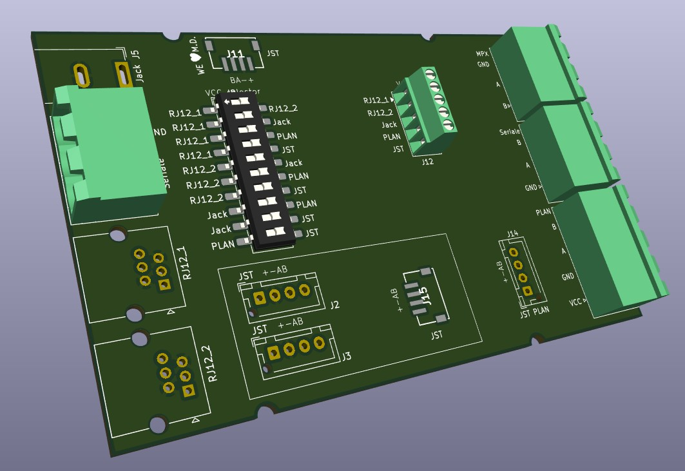

# RS-485 Multi-Socket Board

## Overview

This project describes a **simple RS-485 interface board** designed to allow communication between devices using **different cable types and connectors**.

The board acts as a passive/low-complexity hub, exposing multiple RS-485 connectors while keeping the electrical interface consistent. It is intended for prototyping, testing, field wiring adaptation, and small installations where flexibility is more important than protocol conversion.

## Features

* Multiple connectors for RS-485 communication
* Designed to support **different cable types** on the same board
* Common RS-485 differential bus (A/B)
* Simple and robust hardware design
* No active logic required for basic operation

## Power Distribution

The board includes a **10-pin selector (jumper-based or switch-based, depending on implementation)** that allows flexible routing of the **VCC line**.

Using this selector, VCC can be:

* Routed to one or more RS-485 connectors
* Isolated from specific connectors if required
* Connected to the external power input

This makes it possible to power connected devices directly from the board or keep power lines separated, depending on the application.

## External Power Input

An external power supply can be connected using a **standard 5 mm DC barrel jack**.

* Typical use: powering the RS-485 bus or connected devices
* The external VCC can be selectively distributed via the 10-pin selector
* Ground is shared across all connectors

> ⚠️ **Note:** Ensure that voltage and current ratings are compatible with all connected devices before enabling VCC routing.

## Typical Use Cases

* RS-485 device testing and debugging
* Adapting different connector standards to a single RS-485 bus
* Rapid prototyping of industrial or home automation networks
* Field wiring where multiple cable types must coexist

## Project Status

This is a **simple hardware project**, intended to be easy to understand, modify, and manufacture. It can be extended with:

* Termination resistors
* Biasing resistors
* Protection components (TVS, fuses)
* Optional active transceivers

## License

This project is released under an open-source license. See the `LICENSE` file for details.

---

If you build or modify this board, contributions and improvements are welcome.
